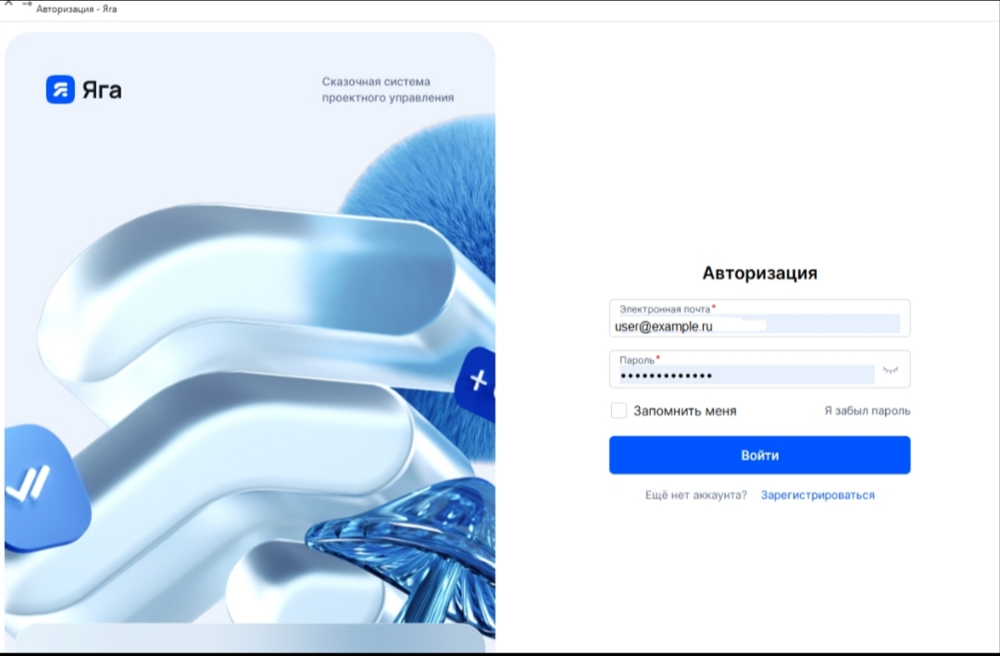

# Описание программы

**УТВЕРЖДЕНО**

RU.РТКЯГА.8000 13-01-ЛУ

---

## ИНФОРМАЦИОННАЯ СИСТЕМА «ЯГА»

## Описание программы

**RU.РТКЯГА.8000 13-01**

**Листов**

**2026**

---

## Аннотация

Настоящий документ описывает логику работы информационной системы «Яга» на уровне функций и отдельных модулей.

---

## Содержание

1. Общие сведения
2. Функциональное назначение
3. Описание логической структуры
   - 3.1. Технологический стек
   - 3.2. Масштабируемость и производительность
4. Используемые технические средства
5. Вызов и загрузка
6. Входные данные
7. Выходные данные

---

## 1. Общие сведения

Информационная система «Яга» предназначена для автоматизации управления проектами, постановки и контроля задач, а также накопления и распространения корпоративных знаний в организациях.

**Область применения:** крупные и средние предприятия, ИТ-команды, продуктовые подразделения, службы технической поддержки и любые распределённые команды, которым требуется единая среда для планирования, отслеживания работ и хранения документации.

---

## 2. Функциональное назначение

**Основные цели применения программы:**

- обеспечение прозрачности хода работ по проектам и задачам;
- сокращение времени на поиск информации за счёт централизованной базы знаний;
- стандартизация постановки задач, статусов и результатов работ;
- поддержка совместной работы распределённых команд;
- формирование отчётности по загрузке сотрудников, срокам и статусам задач.

---

## 3. Описание логической структуры

Программа реализует следующие основные функции:

**Управление задачами и проектами:** создание задач, назначение исполнителей, установка сроков, приоритетов и зависимостей; ведение досок (Kanban), спринтов и дорожных карт.

**База знаний и вики-контент:** создание и редактирование статей, структурирование контента по пространствам и разделам, версионирование документов, поиск и тегирование.

**Ролевая модель и безопасность:** разграничение прав доступа по ролям (администратор, руководитель, исполнитель, наблюдатель), аудит действий пользователей, ведение журнала изменений.

**Отчётность и аналитика:** формирование отчётов по статусам задач, срокам, загрузке сотрудников; визуализация метрик (диаграммы сгорания, графики загрузки).

**Коммуникации в рамках задач:** комментарии, упоминания пользователей, прикрепление файлов, история изменений.

### 3.1. Технологический стек

| Компонент | Технология |
|---|---|
| **Backend** | Java 17, Spring Boot 3.x |
| **Frontend** | React 18, TypeScript, Redux Toolkit |
| **СУБД** | PostgreSQL 15 |
| **Кэширование** | Redis 7 |
| **Очереди сообщений** | RabbitMQ |
| **Полнотекстовый поиск** | Elasticsearch 8 |
| **Контейнеризация** | Docker, Kubernetes |
| **CI/CD** | GitLab CI / GitHub Actions |
| **Мониторинг** | Prometheus + Grafana |
| **Логирование** | ELK Stack (Elasticsearch, Logstash, Kibana) |

Архитектура построена по принципам микросервисов: каждый модуль (задачи, статьи, уведомления, аутентификация) работает как независимый сервис, взаимодействующий через REST API и сообщения. Это обеспечивает независимое масштабирование и отказоустойчивость.

### 3.2. Масштабируемость и производительность

**Горизонтальное масштабирование:** каждый микросервис может быть развернут в нескольких экземплярах. Балансировщик нагрузки (Nginx / Kubernetes Ingress) распределяет запросы между экземплярами.

**Производительность:**

- Среднее время ответа API — менее 300 мс при нагрузке до 500 одновременных пользователей.
- Индексирование статей базы знаний через Elasticsearch обеспечивает поиск по миллионам документов менее чем за 1 секунду.
- Кэширование часто запрашиваемых данных в Redis снижает нагрузку на СУБД на 60–70%.
- Асинхронная обработка уведомлений через RabbitMQ исключает задержки в интерфейсе пользователя.

**Пределы масштабирования:** архитектура поддерживает до 10 000 активных пользователей и до 1 000 000 задач в одной инсталляции при адекватном аппаратном обеспечении.

---

## 4. Используемые технические средства

Для корректной работы информационной системы «Яга» рабочее место должно быть оснащено персональным компьютером или ноутбуком с доступом в интернет. Должно быть установлено следующее ПО:

- операционная система Microsoft Windows 10 и её более поздние версии;
- браузеры Chrome, Yandex Browser последних версий.

**Версия модуля задач:** v8.1.0

**Версия модуля статей:** v7.0.0

---

## 5. Вызов и загрузка

Для входа в систему необходимо:

1. Открыть в браузере (Chrome, Yandex Browser) страницу авторизации. Отобразится интерфейс аутентификации пользователя с полями для ввода идентификационных данных.

2. Заполнить все поля. В поле «Логин» вводится доменная почта пользователя, в поле «Пароль» — пароль пользователя для входа в систему. При необходимости можно посмотреть введённый пароль, нажав на кнопку в виде «глаза».

3. Войти в систему. Вход осуществляется при нажатии на кнопку «Войти».

> **Скриншот: Форма авторизации в ИС «Яга»**
>
> 

**Рисунок 1 — Форма авторизации в ИС «Яга»**

---

## 6. Входные данные

- Пользовательские запросы (создание, редактирование, удаление задач и статей).
- Задачи (название, описание, исполнитель, срок, приоритет, теги, вложения).
- Документы (статьи базы знаний, вложения, изображения, файлы).
- Метаданные проектов (настройки пространства, ролевая модель, шаблоны).
- Данные из интегрированных систем (LDAP/AD — учётные записи пользователей; SMTP — параметры почтовых уведомлений; внешние API — webhook-события).

---

## 7. Выходные данные

- Отчёты по проектам, задачам, загрузке сотрудников (в форматах PDF, CSV, XLSX).
- Уведомления (email, Telegram, внутри системы).
- Экспортируемые документы (PDF, CSV, Markdown, HTML).
- Логи действий пользователей (журнал аудита).
- Версии статей базы знаний (история изменений с возможностью отката).
- Данные через REST API для внешних систем (в формате JSON).

---

## Лист регистрации изменений

| Изм | (измененных / замененных / новых / аннулированных) | Всего листов в докум. | № докум. | № сопроводительного документа и дата | Подпись | Дата |
|---|---|---|---|---|---|---|
| | | | | | | |
| | | | | | | |
| | | | | | | |
| | | | | | | |
