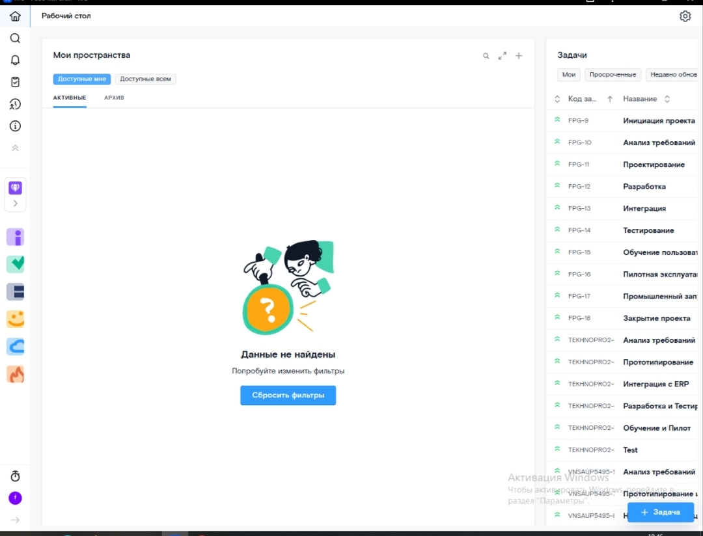

# Руководство оператора

**УТВЕРЖДЕНО**

RU.РТКЯГА.8000 34-01-ЛУ

---

## ИНФОРМАЦИОННАЯ СИСТЕМА «ЯГА»

## Руководство оператора

**RU.РТКЯГА.8000 34-01**

**Листов**

**2026**

---

## Аннотация

Настоящий документ содержит сведения, необходимые оператору для эксплуатации информационной системы «Яга» (далее — ИС). В руководстве приведены назначение системы, условия её функционирования, порядок действий оператора при работе с системой, а также описание сообщений и способы реагирования на них.

---

## Содержание

1. Назначение программы
2. Условия выполнения программы
3. Выполнение программы
   - 3.1. Начало работы
   - 3.2. Элементы стартовой страницы
   - 3.3. Назначение исполнителя
   - 3.4. Создание и редактирование задач
   - 3.5. Работа с Kanban-досками
   - 3.6. Работа с базой знаний
   - 3.7. Поиск и фильтрация
4. Сообщения оператору

---

## 1. Назначение программы

ИС «Яга» предназначена для автоматизации учёта, обработки и анализа данных в ИТ-командах, бизнес-подразделениях, управлении проектами.

**Основные функции системы:**

- управление проектами;
- управление задачами;
- контроль прогресса выполнения задач;
- разграничение прав доступа пользователей.

ИС «Яга» рассчитана на работу операторов, администраторов и конечных пользователей с базовой компьютерной подготовкой.

---

## 2. Условия выполнения программы

Для корректной работы ИС «Яга» рабочее место должно быть оснащено персональным компьютером или ноутбуком с доступом в интернет. Должно быть установлено следующее ПО:

- операционная система Microsoft Windows 10 и её более поздние версии;
- браузеры Chrome, Yandex Browser последних версий.

**Версия модуля задач:** v8.1.0

**Версия модуля статей:** v7.0.0

---

## 3. Выполнение программы

### 3.1. Начало работы

Для входа в систему необходимо:

1. Открыть в браузере (Chrome, Yandex Browser) страницу авторизации. Отобразится интерфейс аутентификации пользователя с полями для ввода идентификационных данных.

2. Заполнить все поля. В поле «Логин» вводится доменная почта пользователя, в поле «Пароль» — пароль пользователя для входа в систему. При необходимости можно посмотреть введённый пароль, нажав на кнопку в виде «глаза».

3. Войти в систему. Вход осуществляется при нажатии на кнопку «Войти».

> **Скриншот: Авторизация в ИС «Яга»**
>
> 

**Рисунок 1 — Авторизация в ИС «Яга»**

### 3.2. Элементы стартовой страницы

После успешной авторизации отображается стартовая страница системы со следующими элементами:

- Виджеты для отображения данных («Мои пространства» и «Задачи»);
- Боковая панель: первый блок («Рабочий стол», «Глобальный поиск», «Уведомления», «Межпроектные виды», «Трудозатраты», «О системе»), второй блок («Выбранное пространство», «О пространстве», «Задача», «Статьи», «Команда», «Файлы», «Скрам»);
- Верхняя часть страницы — «Настройки».

> **Скриншот: Стартовая страница системы**
>
> 

**Рисунок 2 — Стартовая страница системы**

### 3.3. Назначение исполнителя

Назначение исполнителей задач осуществляется через функционал модуля «Яга Задачи». Этот модуль — ключевой элемент платформы, который позволяет управлять проектами, задачами, ролями и процессами.

**Особенности назначения исполнителей:**

- при создании задачи можно явно указать назначенного исполнителя;
- для каждого проекта создаётся отдельное рабочее пространство с собственными настройками и ролевой моделью, что позволяет детально регулировать права доступа и распределять ответственность;
- система поддерживает гибкое управление доступом, включая назначение ролей с разными уровнями доступа для совместной работы над проектами;
- возможна автоматизация действий при изменении статусов или сроков.

### 3.4. Создание и редактирование задач

Для создания новой задачи:

1. В боковой панели выбрать пространство, в котором будет создана задача.
2. Перейти в раздел «Задача».
3. Нажать кнопку «Создать задачу».
4. Заполнить обязательные поля:
   - **Название** — краткое описание задачи;
   - **Описание** — подробная постановка;
   - **Исполнитель** — назначить ответственного сотрудника;
   - **Срок** — дедлайн выполнения;
   - **Приоритет** — низкий, средний, высокий, критический.
5. При необходимости добавить теги, прикрепить файлы, указать связанные задачи (блокирующие/блокируемые).
6. Нажать кнопку «Сохранить».

Для редактирования задачи — открыть карточку задачи, внести изменения и сохранить. История изменений сохраняется автоматически и доступна во вкладке «История».

### 3.5. Работа с Kanban-досками

Kanban-доска — визуальное представление задач по статусам выполнения.

**Доступные статусы по умолчанию:**

- **Бэклог** — задачи, ожидающие принятия в работу;
- **В работе** — задачи, находящиеся в активной обработке;
- **Ревью** — задачи, ожидающие проверки;
- **Готово** — завершённые задачи.

**Действия с задачами на доске:**

- Перетаскивание карточки между колонками — изменение статуса задачи.
- Клик по карточке — открытие детальной карточки задачи.
- Фильтрация по исполнителю, приоритету, тегам — через панель фильтров над доской.
- Настройка колонок — через кнопку «Настройки доски» (доступно администратору пространства).

### 3.6. Работа с базой знаний

База знаний («Яга Статьи») — модуль для создания, хранения и структурирования корпоративной документации.

**Создание статьи:**

1. Выбрать пространство в боковой панели.
2. Перейти в раздел «Статьи».
3. Нажать «Создать статью».
4. Заполнить поля:
   - **Заголовок** — название статьи;
   - **Содержание** — текст статьи с поддержкой форматирования (жирный, курсив, списки, таблицы, вставка изображений и кода);
   - **Теги** — ключевые слова для поиска;
   - **Доступ** — указать, кто может просматривать и редактировать.
5. Нажать «Опубликовать».

**Версионирование:** при каждом сохранении создаётся новая версия статьи. Предыдущие версии можно просмотреть и восстановить через меню «История версий».

### 3.7. Поиск и фильтрация

**Глобальный поиск** — доступен из боковой панели («Глобальный поиск»). Позволяет искать задачи, статьи, файлы и комментарии по ключевым словам во всех доступных пространствах.

**Фильтрация задач:**

- по исполнителю;
- по статусу;
- по приоритету;
- по тегам;
- по сроку (просроченные, на сегодня, на неделю);
- по проекту/пространству.

Для сброса всех фильтров используется кнопка «Сбросить фильтры».

---

## 4. Сообщения оператору

При работе с системой оператору могут выводиться следующие сообщения. В таблице 1 приведены типовые сообщения, их возможные причины и рекомендуемые действия.

| Сообщение | Возможная причина | Рекомендуемые действия |
|---|---|---|
| «Неверный логин или пароль» | Введены некорректные учётные данные | Проверить правильность ввода логина и пароля. При необходимости воспользоваться функцией восстановления пароля |
| «Данные не найдены» | Отсутствуют данные, удовлетворяющие выбранным фильтрам | Изменить параметры фильтрации или сбросить фильтры кнопкой «Сбросить фильтры» |
| «Нет доступа к пространству» | У пользователя нет прав на просмотр данного пространства | Обратиться к администратору системы для предоставления доступа |
| «Сессия истекла» | Время неактивности пользователя превысило допустимый лимит | Повторно авторизоваться в системе |

**Таблица 1 — Типовые сообщения оператору и рекомендуемые действия**

---

## Лист регистрации изменений

| Изм | (измененных / замененных / новых / аннулированных) | Всего листов в докум. | № докум. | № сопроводительного документа и дата | Подпись | Дата |
|---|---|---|---|---|---|---|
| | | | | | | |
| | | | | | | |
| | | | | | | |
| | | | | | | |
